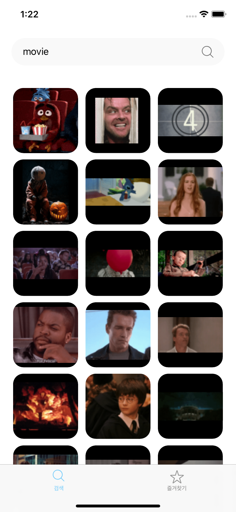
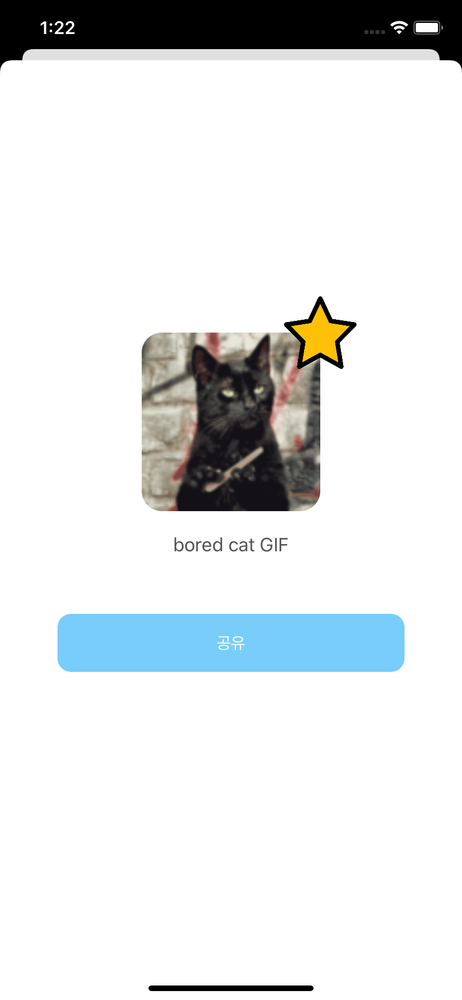

# Gif 검색/즐겨찾기 앱
움직이는 gif를 검색할 수 있고, 상세 정보를 볼 수 있으며, 마음에 드는 gif를 즐겨찾기할 수 있는 iOS 앱 개발 프로젝트입니다.
- 과제 가이드: https://drive.google.com/file/d/1n3TkNyDjOr0Dw7NHMDD2GgbHkN96NmfY/view

## [ 프로젝트 개발환경 ]
- iOS Depolyment Target: `Xcode 11.6`
- Supporting Device Target: `iOS 13`
- CocoPods Version:  `1.10.0.beta.2`
- Language: `Swift`

## [ 라이브러리 ]
- [Alamofire](https://github.com/Alamofire/Alamofire)
- [Kingfisher](https://github.com/onevcat/Kingfisher)
- [SwiftJSON](https://github.com/SwiftyJSON/SwiftyJSON)

## [ 미리보기 ]
| 검색 화면                    | 즐겨찾기 화면                                  | 모달 화면                                  |
|:------------------------------:|:---------------------------------:|:---------------------------------:|
|</img> | | |

### [ 기능 ]
#### 1. 검색 기능
**기본 기능**  
| 번호                    | 기능                                  | 구현 여부                                  |
|:------------------------------:|:---------------------------------:|:---------------------------------:|
|1 |Giphy API를 이용한 정적인 GIF 이미지 검색 기능 | O |
|1-1 |상단 [검색하기] 텍스트필드가 포커스 되면 키보드가 보여지도록 구현 | O |
|1-2 |스크롤뷰를 스크롤했을 때, 키보드의 Enter를 쳤을 때, 키보드가 내려가도록 구현 | O |
|1-3 |영단어를 입력했을 때마다 검색 API를 호출하도록 구현 |  △ |
|2 |검색 필드에 빈 텍스트가 입력되어 있다면 빈 화면을 보여주도록 구현 | O |
|3 |페이징을 이용해 API의 최대로 조회 가능한 이미지 갯수 (limit=24)만큼 불러오도록 구현 | O |
|4 |리스트 최하단에 <더보기> 버튼을 두어, 이후의 더 많은 이미지를 불러올 수 있도록 구현 | O |
|5 |각 이미지를 누를 때 Modal이 뜨도록 구현 | O |

**필수 사항**  
| 번호                    | 기능                                  | 구현 여부                                  |
|:------------------------------:|:---------------------------------:|:---------------------------------:|
|1 |어느 디바이스에서든 한 row에 최대 3개 단위의 이미지가 그리드 형식으로 노출되도록 구현 | O |
|1-1 |그리드 내의 Cell은 가로 세로의 길이는 1:1로 동일하게 구현 | O |
|2 |이미지 비율은 유지된 채 사이즈가 Cell의 사이즈를 넘지 않도록 맞추기 | O |

**추가 기능**  
| 번호                    | 기능                                  | 구현 여부                                  |
|:------------------------------:|:---------------------------------:|:---------------------------------:|
|1 |정적인 GIF 이미지를 동적으로 움직이게 구현 | X |
|2 |무한스크롤을 적용하여 끊임 없이 이미지가 로드될 수 있도록 구현 | O |
|3 |검색어가 입력되지 않았다면 trend API를 이용하여 최신 트렌드 GIF를 기본적으로 리스팅하도록 구현 | X |
|4 |이미지가 로딩될 때 placeholder 이미지 넣기 | O |
|5 |네트워크 에러 등에 의해 API 통신이 불가능한 경우 Alert 등으로 사용자에게 안내하기 | O |

**그 외 구현 기능**

#### 2. 즐겨찾기 기능**
**기본 기능**  
| 번호                    | 기능                                  | 구현 여부                                  |
|:------------------------------:|:---------------------------------:|:---------------------------------:|
|1 |내가 즐겨찾기한 이미지 볼 수 있게 구현 | O |
|2 |각 이미지를 누를 경우 Modal 띄우기 | O |

**필수 사항**  
| 번호                    | 기능                                  | 구현 여부                                  |
|:------------------------------:|:---------------------------------:|:---------------------------------:|
|1 |앱을 종료하기 전까지 내가 즐겨찾기한 이미지가 휘발되지 않게 구현 | O |
|2 |최대 20개의 이미지를 즐겨찾기 등록할 수 있도록 구현 | O |
|2-1 |최대 20개 이상 등록 시 경고문구와 함께 즐겨찾기에 등록되지 않도록 구현 | O |
|3 |어느 디바이스에서든 한 row에 최대 3개 단위의 이미지가 그리드 형식으로 노출되도록 구현 | O |
|3-1 |그리드 내의 Cell은 가로 세로의 길이가 1:1로 동일하도록 구현 | O |
|4 |이미지 비율은 유지된 채 사이즈가 Cell의 사이즈를 넘지 않도록 맞추기 | O |

**추가 기능**  
| 번호                    | 기능                                  | 구현 여부                                  |
|:------------------------------:|:---------------------------------:|:---------------------------------:|
|1 |정적인 GIF 이미지를 동적으로 움직이게 구현 | X |
|2 |즐겨찾기 한 내용이 없을 때 빈화면을 효과적으로 유저에게 커뮤니케이션 | O |
|3 |앱을 종료하더라도 Local Storage(UserDefault, CoreData, Realm 등)을 이용하여 휘발되지 않도록 구현 | O |
|4 |가장 최근에 즐겨찾기한 이미지가 최상단에 보일 수 있도록 구현 | O |
|5 |이미지가 로딩될 때 placeholder 이미지 넣기 | O |
|5 |네트워크 에러 등에 의해 API 통신이 불가능한 경우 Alert 등으로 사용자에게 안내하기 | O |

#### 3. 모달 기능**  
탭1, 탭2에서 이미지 선택 시 보여지는 Modal창

**기본 기능**  
| 번호                    | 기능                                  | 구현 여부                                  |
|:------------------------------:|:---------------------------------:|:---------------------------------:|
|1 |Modal로 보여지게 구현 | O |
|2 |정적인 이미지와 관련 정보(이름, rate 등) 텍스트를 보여주도록 구현 | O |
|3 |타인에게 이미지 주소와 이름을 공유할 수 있는 버튼을 포함 | O |
|4 |별 표시 버튼을 통해 마음에 드는 이미지를 즐겨찾기, 해제할 수 있게 구현 | O |

**필수 사항**  
| 번호                    | 기능                                  | 구현 여부                                  |
|:------------------------------:|:---------------------------------:|:---------------------------------:|
|1 |이미지의 크기는 160X160 이내에서 비율이 유지된 채고 보여지도록 구현 | O |
|2 |이미 즐겨찾기에 등록한 이미지가 20개 이상이라면 신규로 즐겨찾기할 수 없도록 구현 | O |

**추가 기능**  
| 번호                    | 기능                                  | 구현 여부                                  |
|:------------------------------:|:---------------------------------:|:---------------------------------:|
|1 |정적인 GIF 이미지를 동적으로 움직이게 구현 | X |
|2 |이미지가 로딩될 때 placeholder 이미지 넣기 | O |
|3 |네트워크 에러 등에 의해 API 통신이 불가능한 경우 Alert 등으로 사용자에게 안내하기 | O |

