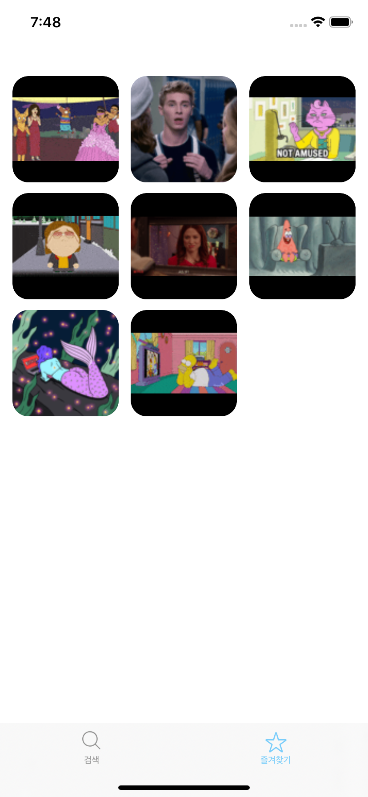

# Gif 검색/즐겨찾기 앱
움직이는 gif를 검색할 수 있고, 상세 정보를 볼 수 있으며, 마음에 드는 gif를 즐겨찾기할 수 있는 iOS 앱 개발 프로젝트입니다.
- 과제 가이드: https://drive.google.com/file/d/1n3TkNyDjOr0Dw7NHMDD2GgbHkN96NmfY/view

## [ 프로젝트 개발환경 ]
- iOS Depolyment Target: `Xcode 11.6`
- Supporting Device Target: `iOS 13`
- CocoPods Version:  `1.10.0.beta.2`
- Language: `Swift`

## [ 라이브러리 ]
- [Alamofire](https://github.com/Alamofire/Alamofire)  
HTTP 통신 중 Alamofire가 제공하는 Request&Response 체이닝 함수와 URL/JSON 형태의 파라미터 인코딩 기능을 사용하기 위해 채택하였습니다.  
- [Kingfisher](https://github.com/onevcat/Kingfisher)  
이미지 로드 속도 개선을 위해 Kingfisher의 이미지 캐시 기능을 사용했습니다.  

## [ 미리보기 ]
| 검색 화면                    | 즐겨찾기 화면                                  | 모달 화면                                  |
|:------------------------------:|:---------------------------------:|:---------------------------------:|
|</img> | | |

### [ 기능 ]
#### 1. 검색 기능 
| 번호                    | 중요도                                  | 기능                                  | 구현 여부                                  |
|:------------------------------:|:---------------------------------:|:---------------------------------:|:---------------------------------:|
|1 |기본|Giphy API를 이용한 정적인 GIF 이미지 검색 기능 | O |
|1-1 |기본|상단 [검색하기] 텍스트필드가 포커스 되면 키보드가 보여지도록 구현 | O |
|1-2 |기본|스크롤뷰를 스크롤했을 때, 키보드의 Enter를 쳤을 때, 키보드가 내려가도록 구현 | O |
|1-3 |기본|영단어를 입력했을 때마다 검색 API를 호출하도록 구현 |  △ |
|2 |기본|검색 필드에 빈 텍스트가 입력되어 있다면 빈 화면을 보여주도록 구현 | O |
|3 |기본|페이징을 이용해 API의 최대로 조회 가능한 이미지 갯수 (limit=24)만큼 불러오도록 구현 | O |
|4 |기본|리스트 최하단에 <더보기> 버튼을 두어, 이후의 더 많은 이미지를 불러올 수 있도록 구현 | O |
|5 |기본|각 이미지를 누를 때 Modal이 뜨도록 구현 | O |
|6 |필수|어느 디바이스에서든 한 row에 최대 3개 단위의 이미지가 그리드 형식으로 노출되도록 구현 | O |
|6-1 |필수|그리드 내의 Cell은 가로 세로의 길이는 1:1로 동일하게 구현 | O |
|7 |필수|이미지 비율은 유지된 채 사이즈가 Cell의 사이즈를 넘지 않도록 맞추기 | O |
|1 |추가|정적인 GIF 이미지를 동적으로 움직이게 구현 | X |
|2 |추가|무한스크롤을 적용하여 끊임 없이 이미지가 로드될 수 있도록 구현 | O |
|3 |추가|검색어가 입력되지 않았다면 trend API를 이용하여 최신 트렌드 GIF를 기본적으로 리스팅하도록 구현 | X |
|4 |추가|이미지가 로딩될 때 placeholder 이미지 넣기 | O |
|5 |추가|네트워크 에러 등에 의해 API 통신이 불가능한 경우 Alert 등으로 사용자에게 안내하기 | O |

#### 2. 즐겨찾기 기능
| 즐겨찾기 해제                    | 즐겨찾기 추가                                  | 즐겨찾기 갯수 제한                    | 즐겨찾기 화면 결과                                  | 즐겨찾기 개수 0개일 때                                  |   
|:------------------------------:|:---------------------------------:|:---------------------------------:|:---------------------------------:|:---------------------------------:|
|</img> | |</img> | | |

| 번호                    | 중요도                                  | 기능                                  | 구현 여부                                  |
|:------------------------------:|:---------------------------------:|:---------------------------------:|:---------------------------------:|
|1 |기본|내가 즐겨찾기한 이미지 볼 수 있게 구현 | O |
|2 |기본|각 이미지를 누를 경우 Modal 띄우기 | O |
|3 |기본|앱을 종료하기 전까지 내가 즐겨찾기한 이미지가 휘발되지 않게 구현 | O |
|4 |기본|최대 20개의 이미지를 즐겨찾기 등록할 수 있도록 구현 | O |
|4-1 |기본|최대 20개 이상 등록 시 경고문구와 함께 즐겨찾기에 등록되지 않도록 구현 | O |
|5 |기본|어느 디바이스에서든 한 row에 최대 3개 단위의 이미지가 그리드 형식으로 노출되도록 구현 | O |
|5-1 |기본|그리드 내의 Cell은 가로 세로의 길이가 1:1로 동일하도록 구현 | O |
|6 |기본|이미지 비율은 유지된 채 사이즈가 Cell의 사이즈를 넘지 않도록 맞추기 | O |
|7 |추가|정적인 GIF 이미지를 동적으로 움직이게 구현 | X |
|8 |추가|즐겨찾기 한 내용이 없을 때 빈화면을 효과적으로 유저에게 커뮤니케이션 | O |
|9 |추가|앱을 종료하더라도 Local Storage를 이용하여 휘발되지 않도록 구현 | O |
|10 |추가|가장 최근에 즐겨찾기한 이미지가 최상단에 보일 수 있도록 구현 | O |
|11 |추가|이미지가 로딩될 때 placeholder 이미지 넣기 | O |
|12 |추가|네트워크 에러 등에 의해 API 통신이 불가능한 경우 Alert 등으로 사용자에게 안내하기 | O |

#### 3. 모달 기능
탭1, 탭2에서 이미지 선택 시 보여지는 Modal창
| 전체 공유                    | 파일 공유                                  |
|:------------------------------:|:---------------------------------:|
|</img> | |

| 네트워크 오류                    |
|:------------------------------:|
|</img> |

| 번호                    | 중요도                                  | 기능                                  | 구현 여부                                  |
|:------------------------------:|:---------------------------------:|:---------------------------------:|:---------------------------------:|
|1 |기본|Modal로 보여지게 구현 | O |
|2 |기본|정적인 이미지와 관련 정보(이름, rate 등) 텍스트를 보여주도록 구현 | O |
|3 |기본|타인에게 이미지 주소와 이름을 공유할 수 있는 버튼을 포함 | O |
|4 |기본|별 표시 버튼을 통해 마음에 드는 이미지를 즐겨찾기, 해제할 수 있게 구현 | O |
|5 |필수|이미지의 크기는 160X160 이내에서 비율이 유지된 채고 보여지도록 구현 | O |
|6 |필수|이미 즐겨찾기에 등록한 이미지가 20개 이상이라면 신규로 즐겨찾기할 수 없도록 구현 | O |
|7 |추가|정적인 GIF 이미지를 동적으로 움직이게 구현 | X |
|8 |추가|이미지가 로딩될 때 placeholder 이미지 넣기 | O |
|9 |추가|네트워크 에러 등에 의해 API 통신이 불가능한 경우 Alert 등으로 사용자에게 안내하기 | O |

### [ 프로젝트 설계 ]
#### 프로젝트 폴더 구조
- `Resources` 폴더: 이미지 등과 같은 프로젝트 리소스를 관리  
- `Sources` 폴더: 프로젝트 소스(Storyboard, ViewController, View, Model, Service)를 관리
- `Utils` 폴더: 프로젝트 전체적으로 사용되는 기타 파일을 관리
   - `Network`폴더: 전체 네트워킹을 지원하는 프로토콜 파일 관리
   - `Extensions` 폴더: `UIView`, `UIViewController` 등의 다양한 Extension 관리
- `SupportingFiles` 폴더: 그 밖의 프로젝트를 지원하는 파일(AppDelegate, SceneDelegate, Info.plist)을 관리

#### 네트워크 레이어 방식 도입
클라이언트에서 **Giphy API** 내용을 읽어들이기 위해서는 많은 함수를 바탕으로 한 요청이 필요하고, 이 과정에서 유사한 코드를 반복적으로 작성해야 했습니다. 이러한 반복적 함수를 제네릭을 바탕으로 해결하기 위해 **네트워크 레이어 방식**을 도입했습니다. 전반적인 구조는 **Controller**, **Middle Layer**, **Service Manager**, **Model** 로 구성됩니다. 

**1. Controller**  
Controller 는 서비스를 호출하는 `ViewController`를 뜻합니다. `ViewController`에서 서비스를 호출하게 되면 Middle Layer를 호출하게 됩니다.  
**2. Middle Layer**  
Middle Layer란 Controller와 Service Manager 사이의 브릿지 역할을 합니다. Middle Layer에서는 응답 코드를 통한 네트워크 상태를 확인합니다.  
**3. Service Manager**  
네트워크 상태가 성공적이라면, 네트워크 레이어의 핵심인 Service Manager에서 Codable을 통해 정의한 **Model**을 통해 파싱한 후 JSON 데이터와 상태값을 반환합니다.  

이후 Controller인 `ViewController`에서 상태 코드와 전달받은 데이터에 맞게 `View`를 바꿔주는 형태로 네트워킹을 구현했습니다.  

### [ 프로젝트 이슈 ]
### 이미지 리스트 스크롤 끊김 현상
**1. 문제정의 **
**2. 원인 **
**3. 해결책 **

### CollectionView 무한 스크롤 기능
**1. 문제정의 **
**2. 원인 **
**3. 해결책 **

### UserDefault의 key값에 Custom value 설정하기
**1. 문제정의 **
**2. 원인 **
**3. 해결책 **

### Modally Present한 Modal창에서 이전 뷰로 데이터 전달하기
**1. 문제정의 **
**2. 원인 **
**3. 해결책 **

### 이미지 캐싱 처리
**1. 문제정의 **
**2. 원인 **
**3. 해결책 **

같은 이미지 URL을 매번 새롭게 호출하는 데에서 오는 지연이 검색 페이지와 즐겨찾기 리스트에 이미지 업로드 속도를 늦춘다고 판단했습니다.  
따라서 이미지 로드 속도 개선을 위해 Kingfisher의 이미지 캐시 기능을 사용했습니다.  

### 가장 최근에 즐겨찾기한 이미지를 
**1. 문제정의 **
**2. 원인 **
**3. 해결책 **

